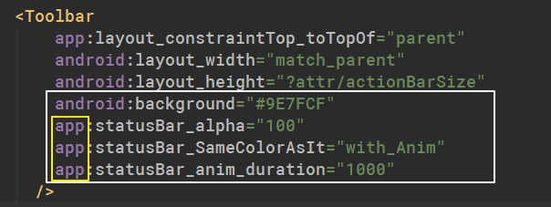
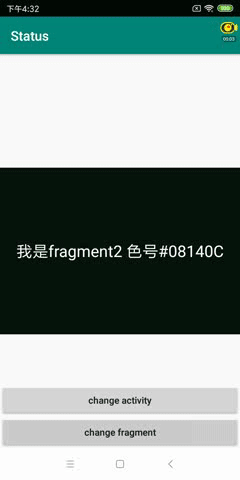

# XmlStatusBarUtils [](https://jitpack.io/#Dboy233/XmlStatusBarUtils) 

## Automatically change the status bar color

## 自动修改状态栏颜色

#### 使用了StatusBarUtil来修改状态栏 https://github.com/laobie/StatusBarUtil
#### 借鉴BackgroundLibray的使用方式 https://github.com/JavaNoober/BackgroundLibrary

#### StatusBarUtil is used to modify the status bar https://github.com/laobie/StatusBarUtil
#### Refer to BackgroundLibray's usage  https://github.com/JavaNoober/BackgroundLibrary

------

#### 只需要在xml文件中表明让状态栏与其相同的颜色标记即可
#### 在fragment和activity中都可以使用

#### You just need to indicate in the XML file that you want the status bar to have the same color tag as it does
#### Available in fragment and activity

```xml
----version 2.1----
	app:statusBar_SameColorAsIt="with_Anim" or "No_Anim" //改变状态栏时需不需要渐变动画
	app:statusBar_alpha="100" //透明度
	app:statusBar_anim_duration="1000"//颜色渐变动画时间

	tools:ignore="MissingPrefix"//忽略前缀app警告
---version 1.0-----
	app:statusBar_SameColorAsIt="true" or "false" //true和false效果一样
	
```

------

Use like this

这样使用

必须要设置背景色



------

This effect

效果



```
dependencies {

  	 implementation 'com.github.Dboy233:XmlStatusBarUtils:2.1'
		
}

```

