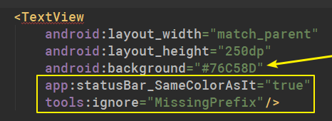

# XmlStatusBarUtils
## Automatically change the status bar color

## 自动修改状态栏颜色

#### 使用了StatusBarUtil来修改状态栏 https://github.com/laobie/StatusBarUtil
#### 借鉴BackgroundLibray的使用方式 https://github.com/JavaNoober/BackgroundLibrary

#### StatusBarUtil is used to modify the status bar https://github.com/laobie/StatusBarUtil
#### Refer to BackgroundLibray's usage  https://github.com/JavaNoober/BackgroundLibrary

------

#### 只需要在xml文件中表明让状态栏与其相同的颜色标记即可
#### 在fragment和activity中都可以使用

#### You just need to indicate in the XML file that you want the status bar to have the same color tag as it does
#### Available in fragment and activity

------

Use like this

这样使用

必须要设置背景色



------

This effect

效果


```
dependencies {
	        implementation 'com.github.Dboy233:XmlStatusBarUtils:1.0'
}

```

